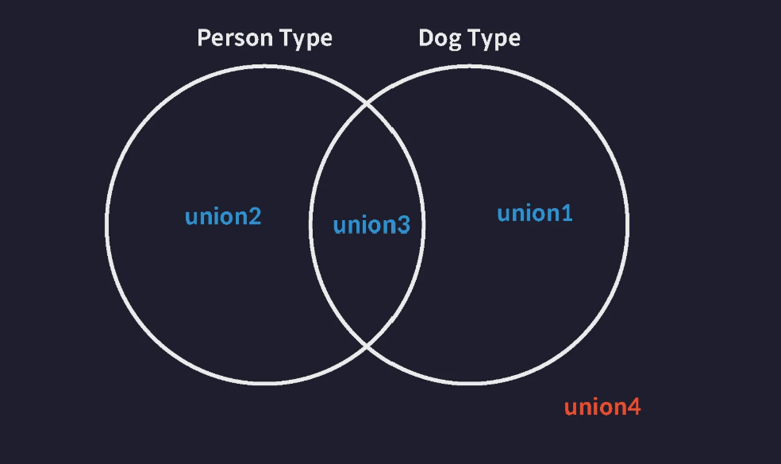

# 타입스크립트 이해하기

## 0. 타입스크립트 이해하기

- 어떤 기준으로 타입을 정의하는지?

- 어떤 기준으로 타입간의 관계를 정의 하는지?

- 어떤 기준으로 타입의 오류를 검사?

## 1. 타입은 집합이다

### 타입 = 집합


``` ts
// number Type (슈퍼 타압)
let num :number = 20;

// number literal Type (서브 타입)
let num :20 = 20;
```

### 타입 호환성

- 어떤 타입을 다른 타입을 취급해도 괜찮은가? 


#### 업 캐스팅

: 서브 타입의 값을 슈퍼 타입의 값으로 취급

: 대부분 가능

#### 다운캐스팅


: 대부분 불가능


## 2. 타입 계층도와 함께 기본타입 살펴보기


### unknown 타입 (전체 집합)

- 모든 값 넣기 가능

```ts
// 업 캐스트 (가능)
let a: unknown = 1;                 // number -> unknown
let b: unknown = "hello";           // string -> unknown
let c: unknown = true;              // boolean -> unknown
let d: unknown = null;              // null -> unknown
let e: unknown = undefined;         // undefined -> unknown
let f: unknown = [];                // Array -> unknown
let g: unknown = {};                // Object -> unknown
let h: unknown = () => {};          // Function -> unknown

// 다운 캐스트 (불가능)
let unknownValue: unknown;

let a: number = unknownValue;
// 오류 : unknown 타입은 number 타입에 할당할 수 없습니다.

```

### never 타입 (공집합 타입)

- 모든 타입의 서브 집합 -> 즉, never 타입은 어떤 타입에든 담기기 가능 (업 캐스팅)

- 다운 캐스팅 불가! -> `어떤 값이든 저장이 되면 안되는 값에 사용`

```ts
let neverVar: never;

// 업 캐스팅
let a: number = neverVar;            // never -> number
let b: string = neverVar;            // never -> string
let c: boolean = neverVar;           // never -> boolean
let d: null = neverVar;              // never -> null
let e: undefined = neverVar;         // never -> undefined
let f: [] = neverVar;                // never -> Array
let g: {} = neverVar;                // never -> Object


// 다운 캐스팅 절대 불가 (즉, 어떤 값이든 절대 담기면 안되는 변수에 사용하기)
```

### void 타입

- 아무것도 반환하지 않는 함수의 반환값 타입으로 주로 사용

- void 타입은 undefined 타입의 슈퍼 타입임

```ts
let voidVar: void;

voidVar = undefined; // undefined -> void (ok)

let neverVar: never;
voidVar = neverVar; // never -> void (ok)
```

### any 타입 (치트키)

- 타입 계층도를 완전히 무시 (모든 타입의 슈퍼 타입이자 서브 타입이 됨.. 단 never타입에는 예외)

- 사용 지양

```ts
let anyValue: any;

let num: number = anyValue;   // any -> number (다운 캐스트)
let str: string = anyValue;   // any -> string (다운 캐스트)
let bool: boolean = anyValue; // any -> boolean (다운 캐스트)

anyValue = num;  // number -> any (업 캐스트)
anyValue = str;  // string -> any (업 캐스트)
anyValue = bool; // boolean -> any (업 캐스트)
```

## 3. 객체 타입의 호환성

### 기본

```ts
// 슈퍼 타입
type Book = {
  name: string;
  price: number;
};

// 서브 타입
//  ProgrammingBook < Book
type ProgrammingBook = {
  name: string;
  price: number;
  skill: string;
};

let book: Book;
let programmingBook: ProgrammingBook = {
  name: "한 입 크기로 잘라먹는 리액트",
  price: 33000,
  skill: "reactjs",
};

book = programmingBook; // ✅ OK -> 업 캐스팅 (슈퍼 = 서브)
programmingBook = book; // ❌ NO -> 다운 캐스팅 (서브 = 슈퍼)
```

### 초과 프로퍼티 검사

- 변수를 객체 리터럴로 초기화 할 때 발동하는 타입스크립트의 특수한 기능

-  타입에 정의된 프로퍼티 외의 다른 초과된 프로퍼티를 갖는 객체를 변수에 할당할 수 없도록 막음

```ts
// 초과 프로퍼티 검사
type Book = {
  name: string;
  price: number;
};

let book2: Book = { // 오류 발생
  name: "한 입 크기로 잘라먹는 리액트",
  price: 33000,
  skill: "reactjs", // -> 여길 주석처리해야 오류 x
};
```

```ts
// 변수에 미리 값을 담아둔 다음 변수값을 인수로 전달
let book3: Book = programmingBook;

func(programmingBook);
```

## 4. 대수 타입

- 여러 개의 타입을 합성해서 새롭게 만들어낸 타입

### 합집합 타입

- 기본

```ts
// 합집합 타입 - Union 타입

// 기본
let a: string | number | boolean;

a = 1;
a = "hello";
a = true;

// 배열
let arr: (number | string | boolean)[] = [1, "hello", true];
```

- 객체 



```ts
type Dog = {
  name: string;
  color: string;
};

type Person = {
  name: string;
  language: string;
};

type Union1 = Dog | Person;

/////////////////////////////

let union1: Union1 = { // ✅
  name: "",
  color: "",
};

let union2: Union1 = { // ✅
  name: "",
  language: "",
};

let union3: Union1 = { // ✅
  name: "",
  color: "",
  language: "",
};


let union4: Union1 = { // ❌ -> 어디에도 포함안됨
  name: "",
};
```

### 교집합 타입

- 기본

```ts
let variable: number & string; 
// never 타입으로 추론된다
```

- 객체

```ts
let intersection1: Intersection = {
  name: "",
  color: "",
  language: "", // 1개 라도 빠지면 에러 ㅇ
};
```

## 5. 타입 추론

- 타입스크립트는 `변수의 초기값`을 기준으로 자동으로 타입을 추론해줌

- 단, 함수의 매개변수는 타입 추론 x -> 정의해줘야 ㅇ

### 주의 사항 (2)

#### Any 타입의 진화

```ts
let d; // 암시적인 any 타입
d = 10; // number
d.toFixed(); // number

d = "hello"; // string
d.toUpperCase(); // string
d.toFixed(); // 오류 
```

#### const 상수의 추론

- const -> Literal 타입(가장 좁은 타입으로 추론)으로 추론

```ts
const num = 10;
// 10 Number Literal 타입으로 추론

const str = "hello";
// "hello" String Literal 타입으로 추론
```

### 최적 공통 타입

- 최적의 공통 타입으로 추론

``` ts
let arr = [1, "string"];
// (string | number)[] 타입으로 추론
```

## 6. 타입 단언

```ts

```

## 7. 타입 좁히기

```ts

```

## 8. 서로소 유니온 타입

```ts

```